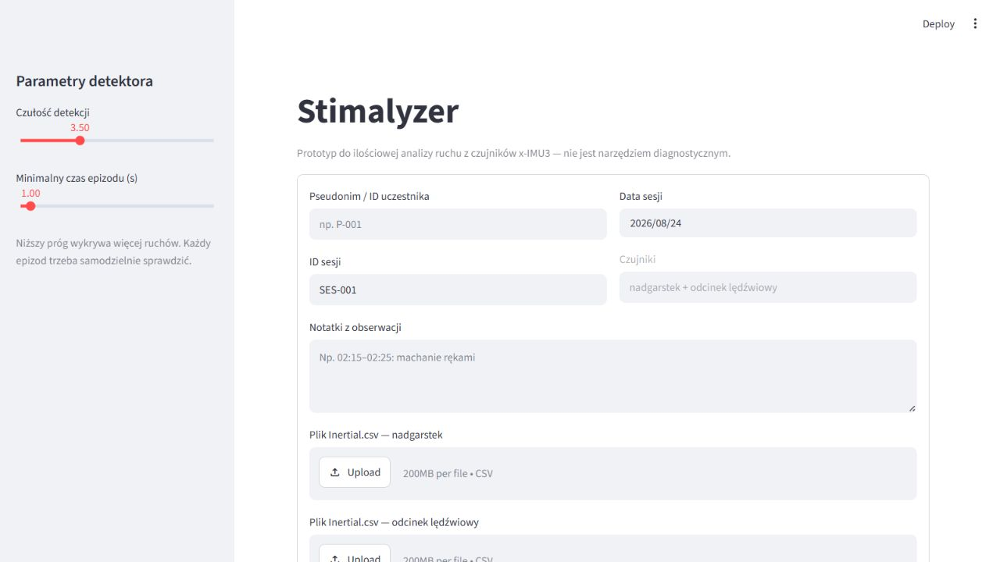

# Stimalyzer

Prototyp badawczy aplikacji Streamlit do analizy ruchu rejestrowanego przez dwa
czujniki x-IMU3: na nadgarstku i w odcinku lędźwiowym. Projekt wspiera
synchronizację nagrań, ręczne etykietowanie czynności oraz eksperymenty z
modelami Human Activity Recognition (HAR).

> [!IMPORTANT]
> Projekt służy wyłącznie do badań i wspomagania analizy ruchu. Wynik modelu nie
> jest diagnozą, opinią kliniczną ani narzędziem do rozpoznawania ASD.



## Co potrafi aplikacja

- przyjmuje dwa pliki `Inertial.csv` z tego samego eksportu x-IMU3;
- synchronizuje nadgarstek i lędźwie na podstawie tego samego ruchu, np. skoku;
- wyświetla osobno osie X/Y/Z akcelerometru i żyroskopu dla obu czujników;
- pokazuje wspólny wskaźnik dynamiki ruchu oraz proponowane epizody do sprawdzenia;
- pozwala ręcznie opisać przedziały czasu etykietami ruchu;
- eksportuje etykiety do formatu `annotations.csv` przydatnego do uczenia modeli.

## Uruchomienie

Wymagany jest Python 3.12 lub nowszy.

```powershell
python -m venv .ml-venv
.\.ml-venv\Scripts\Activate.ps1
python -m pip install -r requirements.txt
streamlit run app.py
```

W aplikacji wybierz dwa pliki `Inertial.csv`: jeden z czujnika na nadgarstku,
drugi z czujnika w okolicy lędźwiowej. Eksport x-IMU3 zawiera wiele CSV, ale do
obecnego modelu używany jest właśnie `Inertial.csv`.

Jeżeli urządzenia zaczęły rejestrację w różnym momencie, znajdź ten sam skok
lub inny wyraźny ruch na obu wykresach i wpisz jego czas dla każdego czujnika.
Aplikacja oblicza przesunięcie:

```text
offset lędźwi = czas skoku na nadgarstku − czas skoku na lędźwiach
```

Następnie buduje wspólną oś czasu, na której wykonuje się etykietowanie.

## Dane do uczenia

Jedna sesja oznacza parę plików: `wrist/Inertial.csv` i `waist/Inertial.csv`.
Plik `data/manifest.csv` opisuje pary plików, uczestnika oraz przesunięcie
czasowe lędźwi. Plik `data/annotations.csv` opisuje przedziały:

```text
session_id,start_s,end_s,label,annotator,comment
SES-001,29,89,x_flapping,IM,pozycja stojąca
```

Etykiety czasowe zawsze odnoszą się do końcowej, zsynchronizowanej osi czasu
w aplikacji. Jeżeli cała sesja została przejrzana, w manifeście ustaw
`fully_annotated` na `TRUE`; wtedy nieopisane okna są traktowane jako `background`.

## Notebook eksperymentalny

Główny notebook to
[`notebooks/training_modelu_krok_po_kroku.ipynb`](notebooks/training_modelu_krok_po_kroku.ipynb).
Uruchamiaj jego komórki od góry do dołu. Notebook:

1. sprawdza manifest i etykiety;
2. tworzy 3-sekundowe okna z krokiem 1 sekundy;
3. wykonuje walidację `Leave-One-Participant-Out` — jedna osoba trafia tylko do testu;
4. porównuje modele klasyczne na cechach;
5. tworzy sekwencje surowych danych `okno × 300 próbek × 12 kanałów` dla 1D CNN i TCN;
6. zapisuje raporty porównawcze w katalogu `reports/`.

Do notebooka wybierz w VS Code kernel:

```text
.ml-venv\Scripts\python.exe
```

## Wyniki pierwszego eksperymentu

Wyniki dotyczą 10 360 okien pochodzących od 15 uczestników. Wszystkie modele
oceniono tą samą walidacją po osobach, dlatego `macro F1` jest główną miarą
porównania.

| Model | Accuracy | Macro F1 |
|---|---:|---:|
| Extra Trees | 77,3% | 73,1% |
| Random Forest | 76,9% | 72,9% |
| SVM RBF | 75,8% | 72,0% |
| Logistic Regression | 75,3% | 71,3% |
| 1D CNN | 74,4% | 68,3% |
| TCN | 74,1% | 67,1% |

Najlepszy wynik uzyskał **Extra Trees**. Dla aktualnego, niewielkiego zbioru
modele klasyczne oparte na cechach przewyższyły modele głębokie uczone na
surowych przebiegach. Wyniki szczegółowe znajdują się po lokalnym uruchomieniu
notebooka w `reports/all_model_comparison.csv`.

## Struktura projektu

```text
app.py                              interfejs Streamlit
scripts/imu_pipeline.py             wczytywanie, synchronizacja i łączenie sygnałów
scripts/build_training_dataset.py   budowa cech dla modeli klasycznych
notebooks/                          notebooki z eksperymentami ML
docs/images/                        zrzuty ekranu aplikacji
data/                               lokalne dane, manifest i etykiety
models/                             lokalnie wytrenowane modele
reports/                            lokalne raporty eksperymentów
```

## Prywatność i ograniczenia

Surowe nagrania, etykiety, modele i raporty są wykluczone z repozytorium,
ponieważ mogą zawierać dane badawcze. Używaj pseudonimów uczestników,
zadbaj o zgodę na udział w badaniu i nie publikuj identyfikowalnych danych.

## Licencja

Nie wybrano jeszcze licencji open-source. Wszelkie prawa zastrzeżone.
